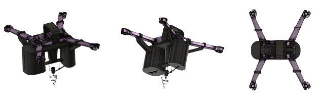

2019 has witnessed an outburst of several wildfires across the globe. From the devastating fires in Australia, California and the Amazon rainforests, to the blazes that destroyed the forests of Lebanon and burned an estimated 3,700 acres of green land during October. All these fires are contributing to the rapidly rising deforestation around the world.

According to The Guardian, deforestation in Brazil – home of the Amazon rainsofrest – has hit the highest annual level in a decade. More than 7,700 square kilometers of rainforest were burnt down during the first nine months of 2019. This represents an 85% increase over the amount of deforestation from the same period in 2018. As such, with this issue becoming more urgent and pressing every day, new methodologies need to be developed to combat deforestation and mitigate its devastating effects.
Traditional reforestation techniques rely on workers to plant trees or seedlings. Nevertheless, this technique is slow and expensive, and workers don’t typically last for more than a season or two due to the physical intensity required by this job. Moreover, fire outbreaks which are hard to contain typically take place in remote areas that are inaccessible by humans. As such, for our final year project, we propose an autonomous unmanned aerial vehicle capable of planting seedlings in remote areas.

The proposed system is composed of the following components:
1) A drone that flies over the remote area to be planted
2) A machine learning algorithm that identifies a space within the area that could be planted
3) A feeding mechanism that stores the seedlings and feeds them to the planting mechanism
4) A planting mechanism that digs in the soil and disposes the seedling appropriately

Several constraints are imposed by this system among which are that the drone must be capable of planting 10 seedlings on one charge and identifying planting locations with an accuracy of at least 90\%. Furthermore, the vehicle must be environmentally friendly and easy to setup and operate.
The progress accomplished so far includes conducting a thorough literature review on currently available systems for planting seeds or seedlings, in addition to proposing several design alternatives for the planting mechanism, setting up the guidelines for collecting the dataset for the machine learning algorithm and choosing the appropriate vehicle for the project from several options proposed.

