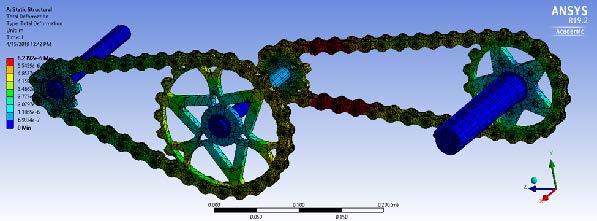

In this project, it is intended to design a two chain sprocket mechanisms to transmit power from the motor to the wheel of the AUB super mileage vehicle. A two-stage gear system was excluded because of the dimensional limitations of the design. Also, belts are not efficient because of the significant power loss. The vehicle is required to accelerate and then cruise at 30 mph at a supplied angular velocity of 3600 rpm. It is also required to accelerate rapidly to reach 3600 rpm in a short time and that is achieved by more frequent burns until a constant burn is maintained. Based on weight, cost, fatigue strength, and contact stresses, a material is to be selected. Stainless steel was found to have the perfect specification for the application. Moreover, the material index proposed should be optimized to incorporate dimensional considerations (width of gears etc.. . . ). Using SolidWorks, the chain-sprocket systems were mounted over the assembly of the motor. In the following week, finite element analysis (ANSYS) will be used in order to enhance the design and compensate for stress concentrations.

